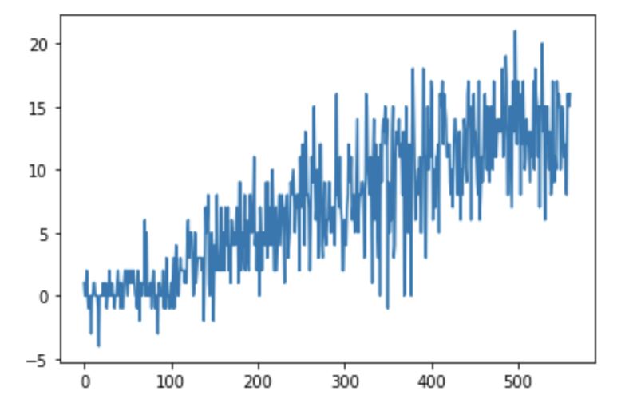
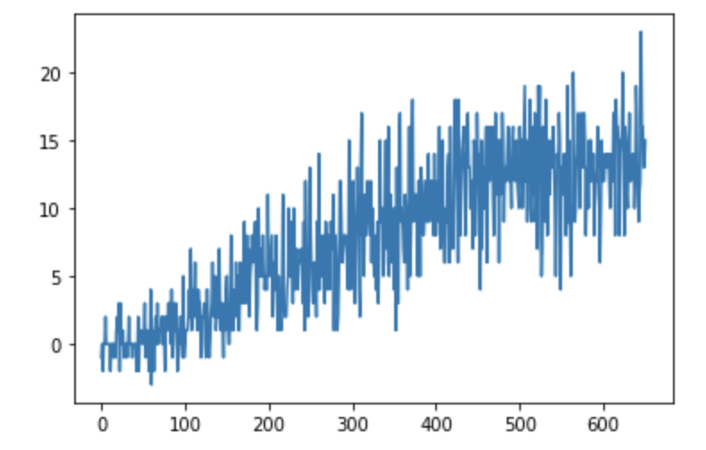
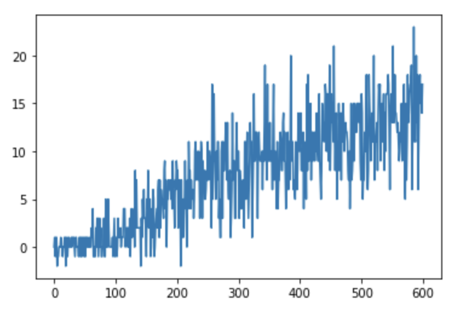
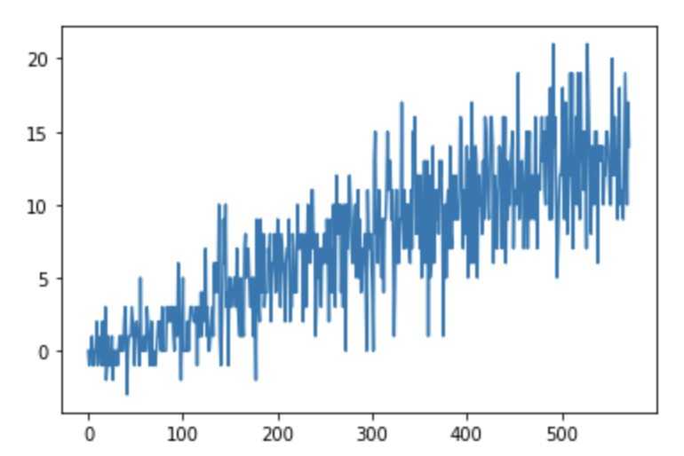

[//]: # (Image References)

[image1]: https://user-images.githubusercontent.com/10624937/42135619-d90f2f28-7d12-11e8-8823-82b970a54d7e.gif "Trained Agent"

# Project 1: Navigation

### Introduction

For this project, you will train an agent to navigate (and collect bananas!) in a large, square world.  

![Trained Agent][image1]

A reward of +1 is provided for collecting a yellow banana, and a reward of -1 is provided for collecting a blue banana.  Thus, the goal of your agent is to collect as many yellow bananas as possible while avoiding blue bananas.  

The state space has 37 dimensions and contains the agent's velocity, along with ray-based perception of objects around agent's forward direction.  Given this information, the agent has to learn how to best select actions.  Four discrete actions are available, corresponding to:
- **`0`** - move forward.
- **`1`** - move backward.
- **`2`** - turn left.
- **`3`** - turn right.

**Completion Criteria**: The task is episodic, and in order to solve the environment, your agent must get an average score of +13 over 100 consecutive episodes.

###Environment###

Environment is simulated in the Unity application called 'Banana.app' and it is located in p1_navigation folder. The code used to run the simulation:
```
env = UnityEnvironment(file_name="Banana.app")
```

###Training 

The number of training session and episodes is decided by the variable `train_numb` & `n_episodes` respectively. Epsilon decides how much importance is given to future results, here `eps_start` & `eps_end` is the starting & and minimum value of epsilon
```
def dqn(n_episodes=2000, eps_start=.99, eps_end=0.01, eps_decay = .996, train_numb = 0):
```

After each training sessions, the obtained weights are saved in 'weights_'+str(train_numb)+'.trn' format.

To train the agent, we use Deep-Q-network which has 2 fully connected layer with 64 units each and output nodes has 4 nodes. 

Code for Deep-Q-Network, fc1 & fc2 are the number of nodes in first and second nodes respectively.
```
   def __init__(self, state_size, action_size, seed, fc1_units=64, fc2_units=64):

        super(QNetwork, self).__init__()
        self.seed = torch.manual_seed(seed)
        self.fc1 = nn.Linear(state_size, fc1_units)
        self.fc2 = nn.Linear(fc1_units, fc2_units)
        self.fc3 = nn.Linear(fc2_units, action_size)
```
Code Implementation
```
    agent = Agent(state_size=37, action_size=4, seed=1, fc1_units=fc1_nodes, fc2_units=fc2_nodes)
    scores, episodes = dqn(n_episodes = 2000, eps_start = epsilon_start, train_numb=i) 
```

###Training Parameters###
We train the following parameters:

- fc1_units: starts with random value, changes from - to - with step size of 
- fc2_units: starts with random value, changes from - to - with step size of 
- eps_start: starts with random value, changes from - to - with step size of  

At the end of each session, parameters with the episodes number are saved in corresponding lists. The lists are used to test the weights for each session:

###Deep-Q-Network algorithm###

The Deep-Q-Network performs double loop. External loop is responsible for episodes if executed till the number of episodes assinged in `n_episodes` variable = 200 or completion criteria is satisfied which is np.mean(score_window) >= 13, where scores_window is an array of length 100 functioning as a shifting window to store 100 most recent enteries.
```
    def dqn(n_episodes=2000, eps_start=.99, eps_end=0.01, eps_decay = .996, train_numb = 0):
```
The element scores_window[i] contains the score achieved by the algorithm at episode i.
```
    scores_window = deque(maxlen=100)   
```
Internal loop (dqn) gets current action from the agent and receives reward the Unity environment. The agent use the `params, state, action, reward, next_state, done` for next training step. The reward is stored and added till to calculate the final reward.
```
    def add(self, state, action, reward, next_state, done):
        """Add a new experience to memory."""
        e = self.experience(state, action, reward, next_state, done)
        self.memory.append(e)
```

###Model Q-Network

The code for `QNetwork` is written in PyTorch and implemented in model.py. Q-Network consist is a neural network which contains 3 fully connected layer with 2 layer rectified non linear layers.
The layers are constructed in the following way:

- Layer fc1 has 64 neurons and it maps state_size x fc1_units
- Layer fc12 has 64 neurons and it maps fc1_units x fc2_units
- Layer fc1 has 64 neurons and it maps fc2_units x input parameters

where state_size = 37, action_size = 8, fc1_units and fc2_units are the input parameters.

###Agent

The code for `class Agent` is written in dqn_agent.py, agent class has many functions:

- Two Q-Networks (local and target) uses Neural Network.
- Replay memory (using the `class ReplayBuffer`)
- Epsilon-greedy Mechanism
- Q-learning, i.e., using the max value for all possible actions
- Computing the loss function by MSE loss
- Minimize the loss by gradient descend mechanism using the ADAM optimizer

###Output of training

fc1_units:  48 , fc2_units:  56

train_numb:  0 eps_start:  0.993

Episode: 561, elapsed: 0:06:28.188530, Avg.Score: 13.03,  score 16.0, How many scores >= 13: 58, eps.: 0.10

 Terminating at episode : 561 ave reward reached +13 over 100 episodes


********************************************************

fc1_units:  112 , fc2_units:  104

train_numb:  1 eps_start:  0.991

Episode: 651, elapsed: 0:08:22.829414, Avg.Score: 13.01,  score 15.0, How many scores >= 13: 56, eps.: 0.07

 Terminating at episode : 651 ave reward reached +13 over 100 episodes


********************************************************

fc1_units:  80 , fc2_units:  80

train_numb:  2 eps_start:  0.991

Episode: 600, elapsed: 0:07:11.168490, Avg.Score: 13.03,  score 17.0, How many scores >= 13: 57, eps.: 0.09

 Terminating at episode : 600 ave reward reached +13 over 100 episodes


********************************************************

fc1_units:  64 , fc2_units:  56

train_numb:  3 eps_start:  0.991

Episode: 525, elapsed: 0:05:57.416309, Avg.Score: 13.01,  score 13.0, How many scores >= 13: 60, eps.: 0.12

 Terminating at episode : 525 ave reward reached +13 over 100 episodes


********************************************************

fc1_units:  64 , fc2_units:  56

train_numb:  4 eps_start:  0.988

Episode: 572, elapsed: 0:06:42.641963, Avg.Score: 13.04,  score 14.0, How many scores >= 13: 52, eps.: 0.10

 Terminating at episode : 572 ave reward reached +13 over 100 episodes
 


********************************************************


**Output of training (Copied from Output of notebook)**


