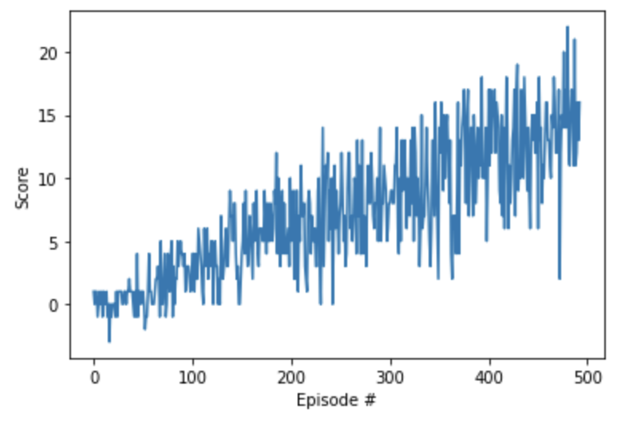

##Project Navigation Report

###Code
 
For training the agent, we used Deep-Q-Learning network, the code is present in dqn_agent.py, model.py, Navigation_Pixels.ipynb.

In model.py, we created a neural network to train the agent, first and second layer both contained 64 units. Input layers takes the state size and output returns the best action once the neural network is completely trained.
  
```
class QNetwork(nn.Module):
    """Actor (Policy) Model."""

    def __init__(self, state_size, action_size, seed, fc1_units=64, fc2_units=64):
        
        super(QNetwork, self).__init__()
        self.seed = torch.manual_seed(seed)
        self.fc1 = nn.Linear(state_size, fc1_units)
        self.fc2 = nn.Linear(fc1_units, fc2_units)
        self.fc3 = nn.Linear(fc2_units, action_size)

    def forward(self, state):
        """Build a network that maps state -> action values."""
        x = F.relu(self.fc1(state))
        x = F.relu(self.fc2(x))
        return self.fc3(x)
```

**Replay memory**

```
class ReplayBuffer:
    """Fixed-size buffer to store experience tuples."""

    def __init__(self, action_size, buffer_size, batch_size, seed):
        """Initialize a ReplayBuffer object.

        Params
        ======
            action_size (int): dimension of each action
            buffer_size (int): maximum size of buffer
            batch_size (int): size of each training batch
            seed (int): random seed
        """
        self.action_size = action_size
        self.memory = deque(maxlen=buffer_size)  
        self.batch_size = batch_size
        self.experience = namedtuple("Experience", field_names=["state", "action", "reward", "next_state", "done"])
        self.seed = random.seed(seed)
    
    def add(self, state, action, reward, next_state, done):
        """Add a new experience to memory."""
        e = self.experience(state, action, reward, next_state, done)
        self.memory.append(e)
    
    def sample(self):
        """Randomly sample a batch of experiences from memory."""
        experiences = random.sample(self.memory, k=self.batch_size)

        states = torch.from_numpy(np.vstack([e.state for e in experiences if e is not None])).float().to(device)
        actions = torch.from_numpy(np.vstack([e.action for e in experiences if e is not None])).long().to(device)
        rewards = torch.from_numpy(np.vstack([e.reward for e in experiences if e is not None])).float().to(device)
        next_states = torch.from_numpy(np.vstack([e.next_state for e in experiences if e is not None])).float().to(device)
        dones = torch.from_numpy(np.vstack([e.done for e in experiences if e is not None]).astype(np.uint8)).float().to(device)
  
        return (states, actions, rewards, next_states, dones)
```

###Model Architecture

The model consists of two hidden layers with 64 units each. Every layer is fully connected. State_size is 37 & action_size is 4.

fc1: Maps state_size to fc1_units

fc2: Maps fc1_units to fc2_units

fc3: Maps fc2_units to action_size


###Hyperparameters

BUFFER_SIZE = int(1e5)  # replay buffer size
BATCH_SIZE = 64         # minibatch size
GAMMA = 0.99            # discount factor
TAU = 1e-3              # for soft update of target parameters
LR = 5e-4               # learning rate 
UPDATE_EVERY = 4        # how often to update the network


- max_t: Number of timesteps is set to 1000, if the agent spends more than specified limit, its likely to be stuck.

- eps_start: Epsilon is set to 1. Epsilon decides the exploration vs exploitation behaviour. In the starting we set epsilon to high value because we want to explore and discover various actions and state.

- eps_decay: After each time step we decrease the exploration factor by certain amount, this allows the agent to exploit the state & value pair it has already discover and select the actions which gives highest reward.

- eps_end: We want eps_end to be some minimal value, to have a very small amount of exploration factor.

- BUFFER_SIZE: Number of experiences it can store, it has been set to 100000 experiences, creating random samples and learn from it.

- UPDATE_EVERY: Dictates how many times the network should be updated, it has been set to 4. After every 4 time steps learn from it.

-  GAMMA: Dictates whether the agent focuses on the immediate reward or future rewards. GAMMA = 1: Agent only cares about the future rewards.
GAMMA = 0: Agent only cares about the immediate reward.

- TAU: Instead of hard update, for soft update: it decided how fast the update of local to target it is, its updates usually give smoother & faster training.

- LR: Decides how big the learning steps is, very high learning step can lead to overshooting. 

###Training 

It took 493 iterations to reach an average score of 13.03

Episode 50	Average Score: 0.344

Episode 100	Average Score: 1.09

Episode 150	Average Score: 2.76

Episode 200	Average Score: 4.89

Episode 250	Average Score: 6.24

Episode 300	Average Score: 7.15

Episode 350	Average Score: 8.39

Episode 400	Average Score: 10.02

Episode 450	Average Score: 11.94

Episode 493	Average Score: 13.03

Environment solved in 493 episodes!	Average Score: 13.03

Time taken to converge is: 637.9585747718811

### Plotting

Plotting has been done using matplot.




###Saving Data

The trained model is saved in saved_weights.pth using the following code.

```      
#Saving the file
torch.save(agent.qnetwork_local.state_dict(), 'saved_weights.pth')

```

### Loading Data

The trained model is loaded using the following code.
```
agent.qnetwork_local.load_state_dict(torch.load('saved_weights.pth'))
```


### Testing

After loading the saved_weights.pth file, we can play the Banana game again.

Score: 14.0

###Future ideas

- We can start by changing the number of layers in the neural network, it took 493 episodes to reach an average score of 13.0. By seeing the graph we can see the score fluctuates a lot.
- Use of better algorithms like Prioritized Experience Replay, which allows us to prioritize the rare actions and learn from it, which are usually lost in DQL.
- Changing epsilon and epsilon decay values while training. Even during testing, epsilon value played a large role in deciding the final score.


