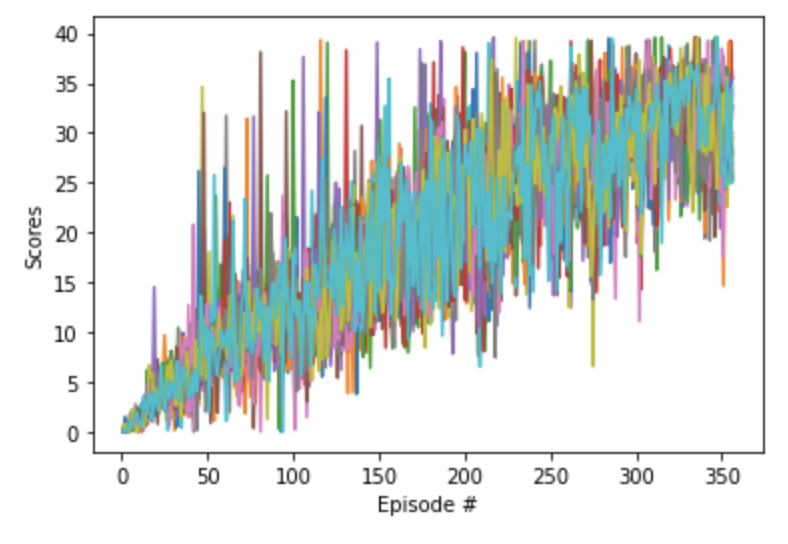

##Project Continuous Report

Completion Criteria: The agent is able to receive an average reward (over 100 episodes, and over all 20 agents) of at least +30.
The submission reports the number of episodes needed to solve the environment.

In this project Deep Deterministic Policy Gradient (DDPG) algorithm is used. DDPG algorithm si designed by tweaking some part of Q-Learning. Instead of one policy gradient DDGP has two, one for Actor and another for Critic.
It is a model free algorithm based on deterministic policy gradient which can be used on continuous action spaces.  It is not possible to apply Q-Learning action spaces, because greedy policy requires optimization at every time step, making the algorithm to be used in real life scenario which have large action spaces.
 
###Actor-Critic
To fix the above problem we use actor-critic approach: 

- The DPG algorithm maintains a parameterized actor function µ(s|θµ) which specifies the current policy by deterministically mapping states to a specific action. 

- The critic Q(s, a) is learned using the Bellman equation as in Q-learning. The actor is updated using chain rule for expected returns and applying batch normalization.
  
  
  
- Approximators, Batch learning & Ornstein-Uhlenbeck noise (SD) is used for stability. “Soft” target updates: A copy of actor and calculator is created Q0
(s, a|θQ0) and µ0(s|θµ0) respectively, which are used to calculate the target values. This means the target values cant change that fast, they are constrained to change slowly. Hence improving the stability.

###Pseudocode


###Code
 
In model.py, we have Actor and Critic class which have their individual neural network:

- Actor: 1 Layer with 256 units.
- Critic: 3 layers with 256, 256 and 128 units with leaky_relu().

**Actor**

```
class Actor(nn.Module):
    """Actor (Policy) Model."""

    def __init__(self, state_size, action_size, seed, fc_units=256):
        """Initialize parameters and build model.
        Params
        ======
            state_size (int): Dimension of each state
            action_size (int): Dimension of each action
            seed (int): Random seed
            fc1_units (int): Number of nodes in first hidden layer
            fc2_units (int): Number of nodes in second hidden layer
        """
        super(Actor, self).__init__()
        self.seed = torch.manual_seed(seed)
        self.fc1 = nn.Linear(state_size, fc_units)
        self.fc2 = nn.Linear(fc_units, action_size)
        self.reset_parameters()

    def reset_parameters(self):
        self.fc1.weight.data.uniform_(*hidden_init(self.fc1))
        self.fc2.weight.data.uniform_(-3e-3, 3e-3)

    def forward(self, state):
        """Build an actor (policy) network that maps states -> actions."""
        x = F.relu(self.fc1(state))
        return F.tanh(self.fc2(x))
```

**Critic**

Since relu() functions suffer from 'dying ReLu' problem, since the slope of ReLu function is negative if the neuron gets stuck on the other side its unlikely to recover. This causes neuron to output zero for every output, making it useless.
Hence nn.leaky_relu is used because it has a small slope of negative side.

```

class Critic(nn.Module):
    """Critic (Value) Model."""

    def __init__(self, state_size, action_size, seed, fcs1_units=256, fc2_units=256, fc3_units=128):
        """Initialize parameters and build model.
        Params
        ======
            state_size (int): Dimension of each state
            action_size (int): Dimension of each action
            seed (int): Random seed
            fcs1_units (int): Number of nodes in the first hidden layer
            fc2_units (int): Number of nodes in the second hidden layer
        """
        super(Critic, self).__init__()
        self.seed = torch.manual_seed(seed)
        self.fcs1 = nn.Linear(state_size, fcs1_units)
        self.fc2 = nn.Linear(fcs1_units+action_size, fc2_units)
        self.fc3 = nn.Linear(fc2_units, fc3_units)
        self.fc4 = nn.Linear(fc3_units, 1)
        self.reset_parameters()

    def reset_parameters(self):
        self.fcs1.weight.data.uniform_(*hidden_init(self.fcs1))
        self.fc2.weight.data.uniform_(*hidden_init(self.fc2))
        self.fc3.weight.data.uniform_(*hidden_init(self.fc3))
        self.fc4.weight.data.uniform_(-3e-3, 3e-3)

    def forward(self, state, action):
        """Build a critic (value) network that maps (state, action) pairs -> Q-values."""
        xs = F.leaky_relu(self.fcs1(state))
        x = torch.cat((xs, action), dim=1)
        x = F.leaky_relu(self.fc2(x))
        x = F.leaky_relu(self.fc3(x))
        return self.fc4(x)
```


###Model

The code for actor & critic is written in PyTorch and implemented in model.py. 
The layers are constructed in the following way:


- Actor: 1 hidden layer of 256 units. (Fully Connected)
- Critic: 3 hidden layers with 256, 256 & 128 units respectively. Critic uses leaky_relu(). (Fully Connected)


###Hyperparameter

- Noise Factor (SD): We have set the SD to 0.1, higher the noise, more deviation there. If the SD was set to 0.2, it took 600 iterations

- Batch Normalization: with learning_from_samples, instead of using Hyperparameter, we created a function learning_from_samples to create a batch of 15 experiences and learn from it. When batch was created of 5 or 10 experience, the overall training was noisy.


###Training 

Episode 50	Average Score: 4.14

Episode 100	Average Score: 7.41

Episode 150	Average Score: 12.66

Episode 200	Average Score: 17.49

Episode 250	Average Score: 22.92

Episode 300	Average Score: 26.83

Episode 350	Average Score: 29.76

Episode 356	Average Score: 30.02

Environment solved in 356 episodes!	Average Score: 30.02

Time taken in seconds: 5295.427741765976


###Testing

Total score (averaged over agents) this episode: 28.94549935301766

###Graphs



###Future ideas

- Experimenting with hyper parameters, experimenting with different BATCH_SIZE could lead to smoother learning whereas different values of SD (Ornstein-Uhlenbeck Noise) could lead to overall better performance.

- Using more number of layers in Actor could lead to a better but slower training, since in this project the actor has only 1 hidden layer with 256 units. We can use different layers and compare the model performance and select the one which gives the best performance.

- Since critic already has 3 hidden layers with 256, 256 and 128 units respectively with leaky_relu(). We can experiment and see how decreasing the number of layers or units in layer effects the performance of the agent. It will also be interesting to see how the performance of the agent changes when relu() function is used instead of leaky_relu().

- In the current project we used DDPG, it will be interesting to see how other models like Proximity Policy Optimization, (A3C) Asynchronous Advantage Actor-Critc, (GAE) Generalized Advantage Estimation perform with the same actor, critic model and hyper parameters. We can check if we need to re-tune the hyper parameters for different algorithms.

