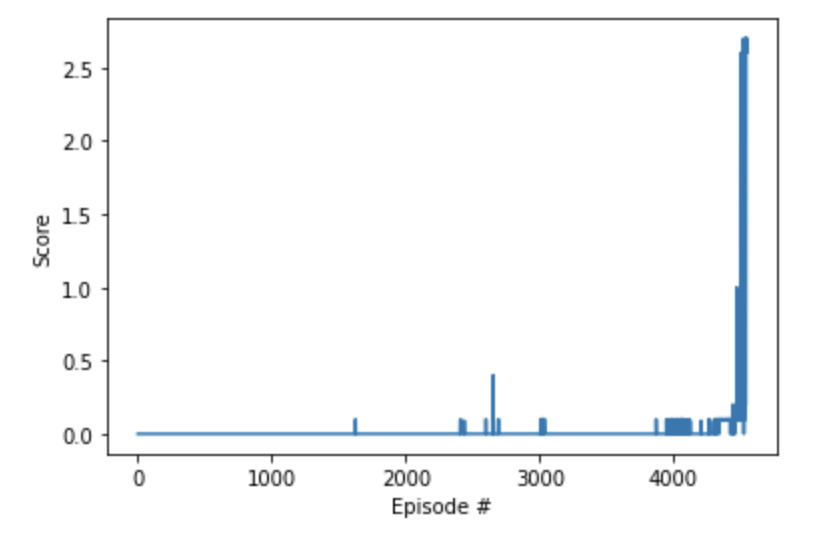
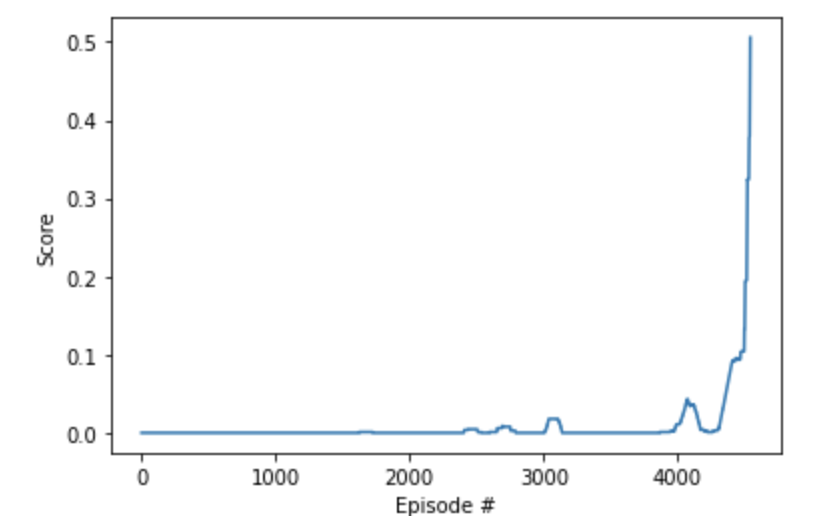
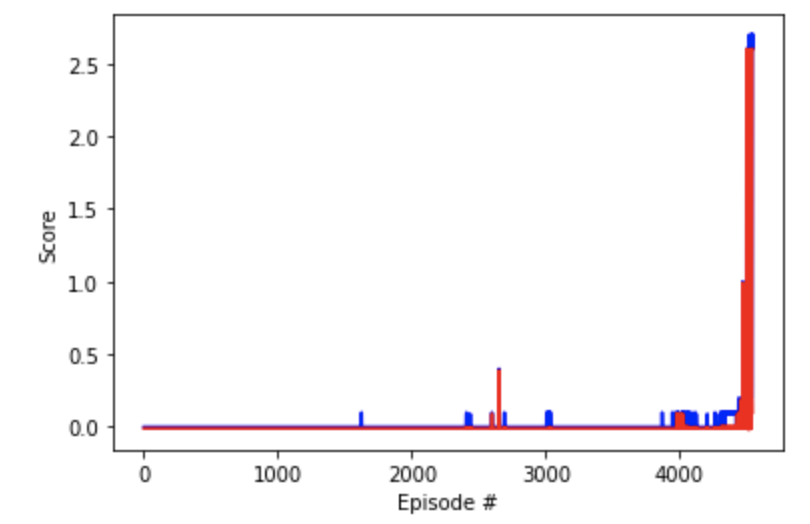

# Project 3: Collaboration and Competition

**Completion Criteria**: The environment is considered solved, when the average (over 100 episodes) of those **scores** is at least +0.5.


In this project Deep Deterministic Policy Gradient (DDPG) algorithm is used to teach two agents to play tennis. DDPG algorithm is designed by tweaking some part of Q-Learning. Instead of one policy gradient DDGP has two, one for Actor and another for Critic.
Most of the code is similar to project-2, certain parameters have been tuned to get better performance.

###Actor-Critic
To fix the above problem we use actor-critic approach: 

- The DPG algorithm maintains a parameterized actor function µ(s|θµ) which specifies the current policy by deterministically mapping states to a specific action. 

- The critic Q(s, a) is learned using the Bellman equation as in Q-learning. The actor is updated using chain rule for expected returns and applying batch normalization.
  
  
  
- Approximators, Batch learning & Ornstein-Uhlenbeck noise (SD) is used for stability. “Soft” target updates: A copy of actor and calculator is created Q0
(s, a|θQ0) and µ0(s|θµ0) respectively, which are used to calculate the target values. This means the target values cant change that fast, they are constrained to change slowly. Hence improving the stability.

###Pseudocode


###Code
 
In model.py, we have Actor and Critic class which have their individual neural network:

- Actor: 1 Layer with 256 units.
- Critic: 3 layers with 256, 256 and 128 units with leaky_relu().

**Actor**

```
class Actor(nn.Module):
    """Actor (Policy) Model."""

    def __init__(self, state_size, action_size, seed, fc_units=256):
        """Initialize parameters and build model.
        Params
        ======
            state_size (int): Dimension of each state
            action_size (int): Dimension of each action
            seed (int): Random seed
            fc1_units (int): Number of nodes in first hidden layer
            fc2_units (int): Number of nodes in second hidden layer
        """
        super(Actor, self).__init__()
        self.seed = torch.manual_seed(seed)
        self.fc1 = nn.Linear(state_size, fc_units)
        self.fc2 = nn.Linear(fc_units, action_size)
        self.reset_parameters()

    def reset_parameters(self):
        self.fc1.weight.data.uniform_(*hidden_init(self.fc1))
        self.fc2.weight.data.uniform_(-3e-3, 3e-3)

    def forward(self, state):
        """Build an actor (policy) network that maps states -> actions."""
        x = F.relu(self.fc1(state))
        return F.tanh(self.fc2(x))
```

**Critic**

Since relu() functions suffer from 'dying ReLu' problem, since the slope of ReLu function is negative if the neuron gets stuck on the other side its unlikely to recover. This causes neuron to output zero for every output, making it useless.
Hence nn.leaky_relu is used because it has a small slope of negative side.

```
class Critic(nn.Module):
    """Critic (Value) Model."""

    def __init__(self, state_size, action_size, seed, fcs1_units=256, fc2_units=256, fc3_units=128):
        """Initialize parameters and build model.
        Params
        ======
            state_size (int): Dimension of each state
            action_size (int): Dimension of each action
            seed (int): Random seed
            fcs1_units (int): Number of nodes in the first hidden layer
            fc2_units (int): Number of nodes in the second hidden layer
        """
        super(Critic, self).__init__()
        self.seed = torch.manual_seed(seed)
        self.fcs1 = nn.Linear(state_size, fcs1_units)
        self.fc2 = nn.Linear(fcs1_units+action_size, fc2_units)
        self.fc3 = nn.Linear(fc2_units, fc3_units)
        self.fc4 = nn.Linear(fc3_units, 1)
        self.reset_parameters()

    def reset_parameters(self):
        self.fcs1.weight.data.uniform_(*hidden_init(self.fcs1))
        self.fc2.weight.data.uniform_(*hidden_init(self.fc2))
        self.fc3.weight.data.uniform_(*hidden_init(self.fc3))
        self.fc4.weight.data.uniform_(-3e-3, 3e-3)

    def forward(self, state, action):
        """Build a critic (value) network that maps (state, action) pairs -> Q-values."""
        xs = F.leaky_relu(self.fcs1(state))
        x = torch.cat((xs, action), dim=1)
        x = F.leaky_relu(self.fc2(x))
        x = F.leaky_relu(self.fc3(x))
        return self.fc4(x)
```


###Model

The code for actor & critic is written in PyTorch and implemented in model.py. 
The layers are constructed in the following way:


- Actor: 1 hidden layer of 256 units. (Fully Connected)
- Critic: 3 hidden layers with 256, 256 & 128 units respectively. Critic uses leaky_relu(). (Fully Connected)


###Hyperparameter

BUFFER_SIZE = int(1e5)  # replay buffer size
BATCH_SIZE = 128        # minibatch size
GAMMA = 0.99            # discount factor
TAU = 1e-3              # for soft update of target parameters
# LR = 5e-4               # learning rate
LR_ACTOR = 1e-4         # learning rate of the actor 
LR_CRITIC = 1e-3        # l earning rate of the critic
# UPDATE_EVERY = 4        # how often to update the network
WEIGHT_DECAY = 0        # L2 weight decay
SD = 0.1             # standard deviation for noise

- BUFFER_SIZE: Number of experiences it can store, it has been set to 100000 experiences, creating random samples and learn from it.

- BATCH_SIZE: Creates a minibatch, which can be used for updating or learning.

- UPDATE_EVERY: Dictates how many times the network should be updated, it has been set to 4. After every 4 time steps learn from it.

-  GAMMA: Dictates whether the agent focuses on the immediate reward or future rewards. GAMMA = 1: Agent only cares about the future rewards.
GAMMA = 0: Agent only cares about the immediate reward.

- TAU: Instead of hard update, for soft update: it decided how fast the update of local to target it is, its updates usually give smoother & faster training.

- LR: Decides how big the learning steps is, very high learning step can lead to overshooting. LR_ACTOR: Learning step for actor, LR_CRITIC learning step for critic.

- WEIGHT_DECAY: L2 regularization is referred as weight_decay. It can be considered as a way of optimizing the cost function.

- Noise Factor (SD): We have set the SD to 0.1, higher the noise, more deviation there. If the SD was set to 0.4, it took 10000+ iterations

- Batch Normalization: with learning_from_samples, instead of using Hyperparameter, we created a function learning_from_samples to create a batch of 15 experiences and learn from it. When batch was created of 5 or 10 experience, the overall training was was slow and didnt show any progress untill 6000 episodes.


###Training 

Since the training took 4544 episodes to reach an average score of 0.5 for 100 consecutive episodes. The entire training process (episode vs scores)
is not mentioned because its too long. It can be viewed in the Tennis.ipyb. 

- Summary mentioned below

Episode 5	 Average Score: 0.0000

Episode 10	 Average Score: 0.0000

Episode 15	 Average Score: 0.0000

Episode 20	 Average Score: 0.0000

Episode 25	 Average Score: 0.0000

.

.

.


Episode 4520	 Average Score: 0.2471

Episode 4525	 Average Score: 0.3231

Episode 4530	 Average Score: 0.3241

Episode 4535	 Average Score: 0.3773

Episode 4540	 Average Score: 0.4045

Episode 4544	 Average Score: 0.5056

Environment solved in 4544 episodes!	Average Score: 0.5056


###Graphs

Plot scores winner score(max score per episode) over episode



Plot of average score(last 100 episodes) over episode



# plot scores of winner agent vs loser agent over episode



###Future ideas

- Experimenting with hyper parameters, experimenting with different BATCH_SIZE could lead to smoother learning whereas different values of SD (Ornstein-Uhlenbeck Noise) could lead to overall better performance. Certain parameter combination give quick improvement of performance in the starting but later the learning rate becomes minimal or the performance might decrease further.

- After changing the number of layers of both actor and critic, it was found that if the number of layers was increased, the performance and the learning rate becomes too less. Even with two hidden, the performance the training time increased drastically. Using different activation function or batch normalization could give better performance.

- Since critic already has 3 hidden layers with 256, 256 and 128 units respectively with leaky_relu(). We can experiment and see how decreasing the number of layers or units in layer effects the performance of the agent. It will also be interesting to see how the performance of the agent changes when relu() function is used instead of leaky_relu().

- In the current project we used DDPG, it will be interesting to see how Mixed Cooperative-Competitive Environments environment will affect the performance of the agent. We can check if we need to re-tune the hyper parameters for different algorithm. Comparing the performance of different collabration-competitive environment will  be interesting to see. 

